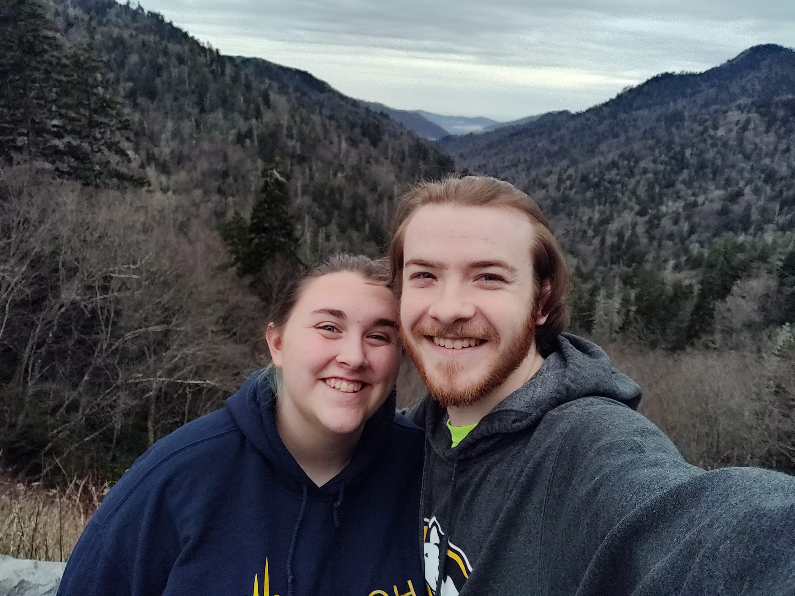

# Cymbre Spoehr - Sim-bree Spore (rhymes with more)
## **She/Her**

Hello! I'm sorry I didn't get this in on time, I missed the fact that it was due when I was doing the preparations before class.

> This is a picture of my husband and I hiking on vacation! I like hiking and spending time outdoors!

I am a Computer Science major, I'm a Senior with an expected graduation date of Spring 2023(yay!) I am an undergraduate student.

I am hoping to be a software developer, I currently have an internship at Gentex, where I am working this summer, writing PC applications for internal use by other engineers throughout the company. I really enjoy it there, and am hoping to work there after graduation, but would be happy to branch out and work on other types of things, possibly web kinds of things! I would like to be in a position where I can problem solve and design, I really enjoy the design aspect of code. I like the idea of being able to have my own company someday, although I don't know what it would be yet.

I am taking this course because I have to take a higher level math class and this seemed like it might be the most applicable to my future degree. I am excited about learning about R, it's always great to learn a new language, and I think that being able to write code in order to do statistical calculations on datasets could definitely be useful in my future career!

I wouldn't say that I have any people who are doing what I'd like to do that I know of - I'm more interested in programming in and of itself. I really like what I'm doing at work, and my coworkers and models are certainly role models to me, but I can't show that to you :(

### Interesting facts about Cymbre
* I played the bassoon in High School and also play the piano and the clarinet.
* I play DnD once a week with a group of friends.
* I did robotics in High School, which is how I got interested in programming in the first place.
* I have 5 siblings, 2 younger brothers, and 3 younger sisters.
